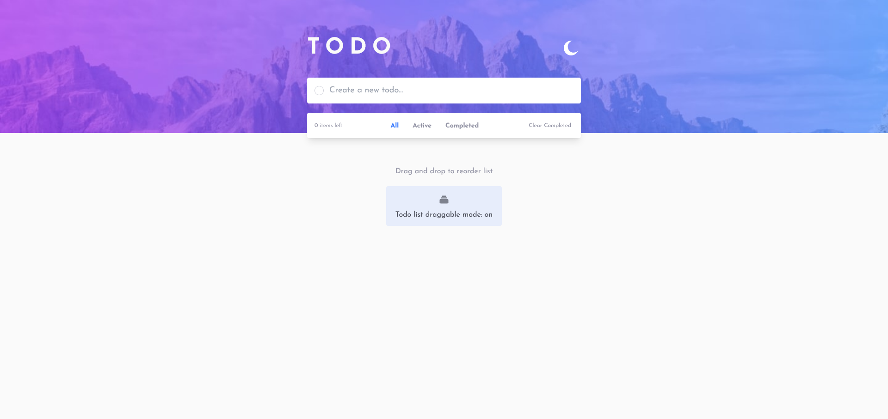
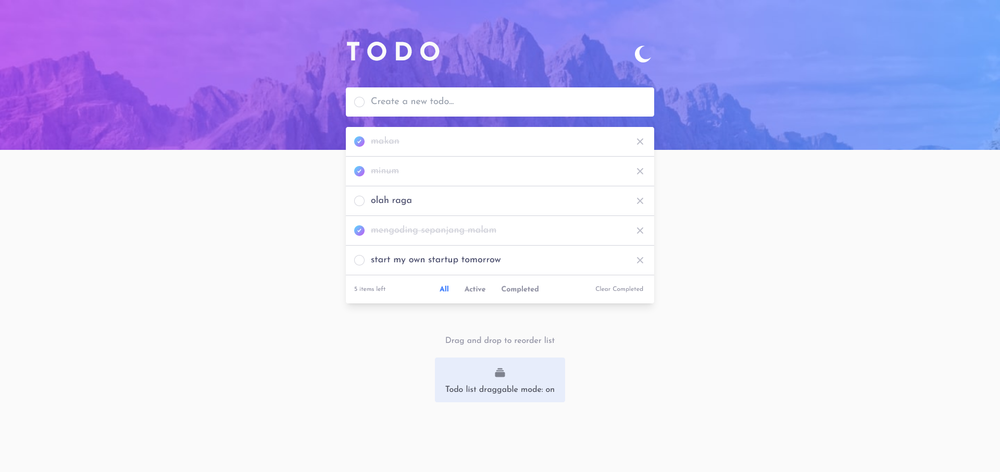
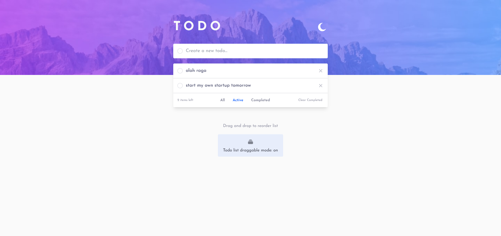
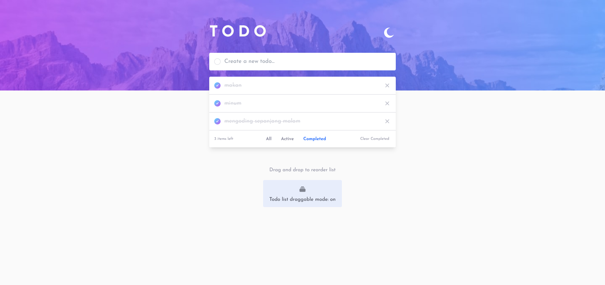
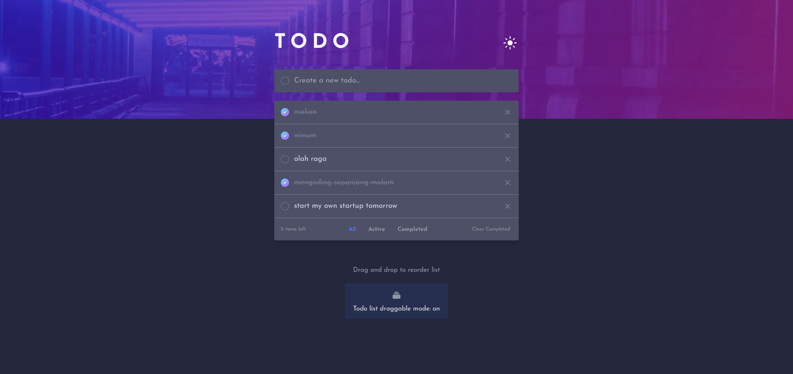
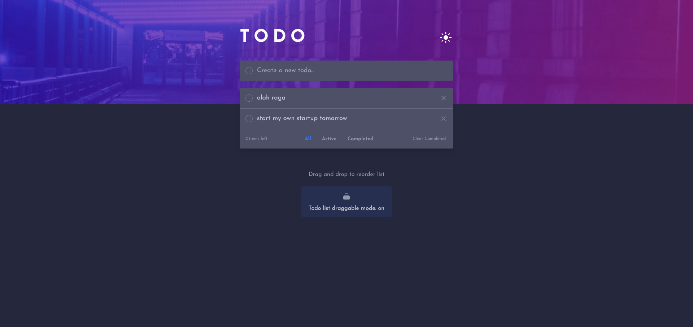
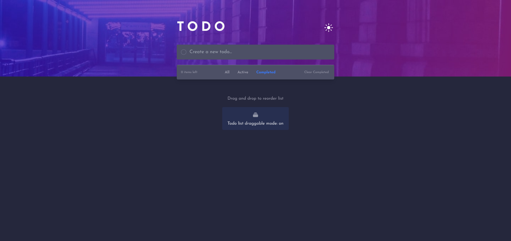

# Frontend Mentor - Todo app solution

This is a solution to the [Todo app challenge on Frontend Mentor](https://www.frontendmentor.io/challenges/todo-app-Su1_KokOW). Frontend Mentor challenges help you improve your coding skills by building realistic projects.

But their **_syle-guide.md_** file (free version) is not that good, you will just get confused by their limited amount of information you need. 🤣

## Table of contents

- [Overview](#overview)
  - [The challenge](#the-challenge)
  - [Screenshot](#screenshot)
  - [Links](#links)
- [My process](#my-process)
  - [Built with](#built-with)
  - [What I learned](#what-i-learned)
  - [Continued development](#continued-development)
  - [Useful resources](#useful-resources)
- [Author](#author)

## Overview

### The challenge

Users should be able to:

- View the optimal layout for the app depending on their device's screen size
- See hover states for all interactive elements on the page
- Add new todos to the list
- Mark todos as complete
- Delete todos from the list
- Filter by all/active/complete todos
- Clear all completed todos
- Toggle light and dark mode
- **Bonus**: Drag and drop to reorder items on the list

### Screenshot

### Links

- Solution URL: [Github Repo](https://github.com/Milkywayrules/femio-todo-app)
- Live Site URL: [Femio Todo App](https://femio-todo-app.vercel.app/)

## My process

### Built with

- Semantic HTML5 markup
- Flexbox (everywhere)
- Mobile-first workflow
- [Vercel](https://vercel.com/) - Host your React/Nextjs/Vue/Nuxtjs/Svelte/etc. for freeee
- [Vite](https://vitejs.dev/) - JS build tool
- [React](https://reactjs.org/) - JS library
- [Tailwindcss](https://tailwindcss.com/) - For beautiful & veryveryvery great styling
- [react-beautiful-dnd (rbd)](https://github.com/atlassian/react-beautiful-dnd) - For easy, beautiful, & accessible drag n drop
- [Prettier](https://prettier.io/) - We know we write messy code, Prettier do the heavy work
- [Typescript](https://www.typescriptlang.org/) - Again, we know we write untrusted code, TS do the heavy work
- [Jotai](https://jotai.org/docs/basics/comparison) - Use Recoil before? Or Redux? Zustand? Or use the context & reducer hooks? Try Jotai 🎉

### What I learned

A lot! But, to be add later if I have more time to write 🚀

### Continued development

I still curious about the advanced implementation of render function. I use that in this project earlier but refactor it since the implementation of drag n drop feature. It's interesting and definitely love to explore more later.

### Useful resources

To be add later, for now take a look at **_Built with_** section above

## Author

- Website - [dioilham.com](https://dioilham.com)
- Frontend Mentor - [@Milkywayrules](https://www.frontendmentor.io/profile/Milkywayrules)
- Github - [@Milkywayrules](https://github.com/milkywayrules)
- Linkedin - [@dioilham](https://www.linkedin.com/in/dioilham/)
- Instagram - [@dioilham](https://www.instagram.com/dioilham)

## Acknowledgments

idk, no one for this project
